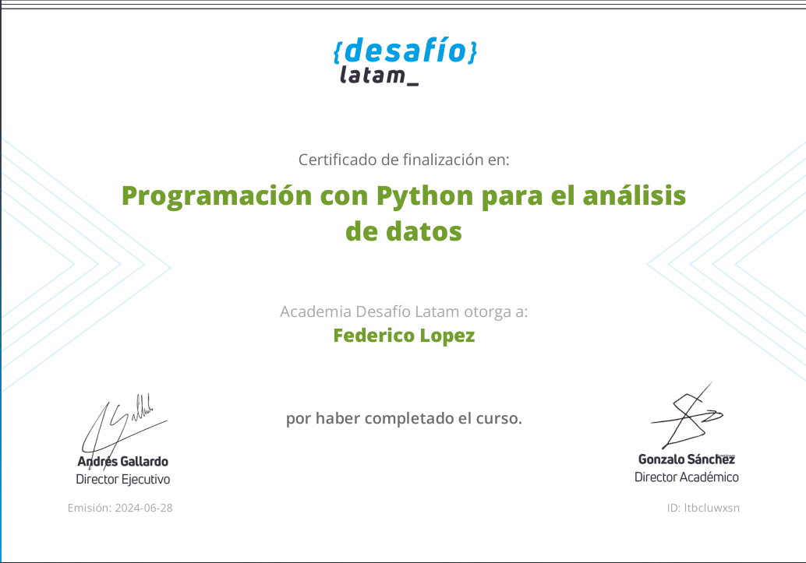

## Programación con Python para el análisis de datos

En DesafíoLatam incentivan el estudio de manera remota, online y desde cero. 
El haber iniciado esta propuesta me refrescó muchas herramientas de como  
poder utilizar python para el modelamiento de datos adecuado para su posterior analisis 

